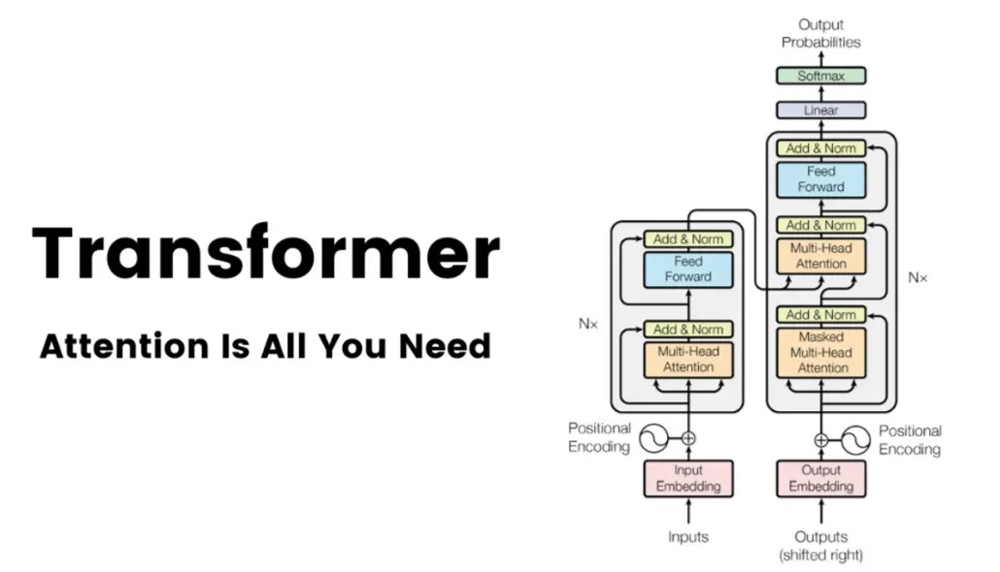

# 07. Transformer Architecture: Encoder-Decoder

<div align="center">
  
  <p><em>The paper that started it all: "Attention is All You Need" (Vaswani et al., 2017)</em></p>
</div>

---

## 🎯 The Complete Picture

We've learned all the building blocks:
- ✅ Self-Attention
- ✅ Multi-Head Attention
- ✅ Positional Encoding
- ✅ Layer Normalization

**Now let's assemble them into the complete Transformer!**

---

## 🏗️ Overall Structure

<div align="center">
  
  <p><em>The original Transformer architecture (Vaswani et al., 2017)</em></p>
</div>

### Two Main Components

```
┌─────────────────────────────────────────┐
│                                         │
│  ┌─────────────┐    ┌─────────────┐   │
│  │   ENCODER   │───→│   DECODER   │   │
│  │   (Left)    │    │   (Right)   │   │
│  └─────────────┘    └─────────────┘   │
│                                         │
│         TRANSFORMER                     │
└─────────────────────────────────────────┘
```

**Key Facts:**
- **Encoder:** 6 identical blocks (Nₓ = 6)
- **Decoder:** 6 identical blocks (Nₓ = 6)
- Understanding ONE block → Understanding the ENTIRE encoder/decoder

---

## 📥 Input Processing Pipeline

**Example Input:** "How are you"

### Step 1: Tokenization

```
Input text: "How are you"
              ↓
Tokenizer
              ↓
Tokens: ["How", "are", "you"]
```

Breaks sentence into individual words/subwords.

---

### Step 2: Embedding Generation

```
Tokens: ["How", "are", "you"]
           ↓       ↓       ↓
    Embedding Layer (512 dim)
           ↓       ↓       ↓
E₁ = [512 dims]  E₂ = [512 dims]  E₃ = [512 dims]
```

Each token → 512-dimensional vector.

---

### Step 3: Positional Encoding

```
E₁, E₂, E₃  (word embeddings)
  +   +   +
P₁, P₂, P₃  (positional encodings)
  =   =   =
X₁, X₂, X₃  (final input to encoder)
```

**Why?** Self-attention has no notion of position!

**Complete Input Processing:**

```
"How are you"
      ↓
[Tokenize]
      ↓
["How", "are", "you"]
      ↓
[Embed (512D)]
      ↓
[E₁, E₂, E₃]
      ↓
[+ Positional Encoding]
      ↓
[X₁, X₂, X₃] → Input to Encoder
```

---

## 🟢 ENCODER Architecture

### Single Encoder Block

```
┌─────────────────────────────────────┐
│         ENCODER BLOCK               │
│                                     │
│  Input (X₁, X₂, X₃)                │
│         ↓                           │
│  ┌─────────────────────┐           │
│  │  Multi-Head         │           │
│  │  Self-Attention     │           │
│  └─────────────────────┘           │
│         ↓                           │
│  ┌─────────────────────┐           │
│  │  Add & Norm         │  ← Residual + Layer Norm
│  └─────────────────────┘           │
│         ↓                           │
│  ┌─────────────────────┐           │
│  │  Feed Forward       │           │
│  │  Network (FFN)      │           │
│  └─────────────────────┘           │
│         ↓                           │
│  ┌─────────────────────┐           │
│  │  Add & Norm         │  ← Residual + Layer Norm
│  └─────────────────────┘           │
│         ↓                           │
│  Output (Z₁, Z₂, Z₃)               │
└─────────────────────────────────────┘
```

---

### Component 1: Multi-Head Self-Attention

**Input:** X = [X₁, X₂, X₃] (3 words, 512 dims each)

```
X → Multi-Head Attention → Z

where:
  - 8 attention heads
  - Each head: d_k = 64 dimensions
  - Total: 8 × 64 = 512
```

**What it does:**
- Each word attends to ALL words (including itself)
- Captures relationships and context
- Produces context-aware representations

---

### Component 2: Add & Norm (Residual + Layer Norm)

```
Input: X
Output from Attention: Z_attn

Residual Connection:
  Z' = X + Z_attn

Layer Normalization:
  Z_norm = LayerNorm(Z')
```

**Why Residual Connections?**
1. Helps gradients flow during backpropagation
2. Stabilizes training
3. Enables deeper networks

**Formula:**
```
Z_norm = LayerNorm(X + MultiHeadAttention(X))
```

---

### Component 3: Feed-Forward Network (FFN)

**A simple 2-layer neural network applied to EACH position independently.**

```
FFN(x) = ReLU(x W₁ + b₁) W₂ + b₂

where:
  W₁: (512, 2048) - expands to 2048 dims
  W₂: (2048, 512) - projects back to 512 dims
```

**Architecture:**
```
Input (512 dims)
      ↓
Linear Layer 1: 512 → 2048
      ↓
ReLU Activation
      ↓
Linear Layer 2: 2048 → 512
      ↓
Output (512 dims)
```

**Key Points:**
- Same FFN applied to every position
- Position-wise: processes each word independently
- Adds non-linearity and transformation capacity

---

### Component 4: Add & Norm (Again)

```
Input to FFN: Z_norm
Output from FFN: Z_ffn

Residual + Layer Norm:
  Y = LayerNorm(Z_norm + Z_ffn)
```

**Complete Encoder Block Formula:**
```python
# Step 1: Multi-head attention + residual + norm
Z = LayerNorm(X + MultiHeadAttention(X))

# Step 2: FFN + residual + norm
Y = LayerNorm(Z + FFN(Z))

# Y is the output of one encoder block
```

---

### Complete Encoder Stack

```
Input (X)
    ↓
[Encoder Block 1]
    ↓
[Encoder Block 2]
    ↓
[Encoder Block 3]
    ↓
[Encoder Block 4]
    ↓
[Encoder Block 5]
    ↓
[Encoder Block 6]
    ↓
Encoder Output (Memory)
```

**6 identical blocks stacked!**

Each block refines the representation further.

---

## 🔵 DECODER Architecture

### Single Decoder Block

```
┌─────────────────────────────────────────┐
│         DECODER BLOCK                   │
│                                         │
│  Output (shifted right)                 │
│         ↓                               │
│  ┌─────────────────────────┐           │
│  │  Masked Multi-Head      │           │
│  │  Self-Attention         │           │
│  └─────────────────────────┘           │
│         ↓                               │
│  ┌─────────────────────────┐           │
│  │  Add & Norm             │           │
│  └─────────────────────────┘           │
│         ↓                               │
│  ┌─────────────────────────┐           │
│  │  Multi-Head             │           │
│  │  Cross-Attention        │  ← Uses Encoder output!
│  │  (Encoder-Decoder Attn) │           │
│  └─────────────────────────┘           │
│         ↓                               │
│  ┌─────────────────────────┐           │
│  │  Add & Norm             │           │
│  └─────────────────────────┘           │
│         ↓                               │
│  ┌─────────────────────────┐           │
│  │  Feed Forward Network   │           │
│  └─────────────────────────┘           │
│         ↓                               │
│  ┌─────────────────────────┐           │
│  │  Add & Norm             │           │
│  └─────────────────────────┘           │
│         ↓                               │
│  Output                                 │
└─────────────────────────────────────────┘
```

---

### Key Difference: Decoder has 3 sub-layers

1. **Masked Multi-Head Self-Attention**
2. **Multi-Head Cross-Attention** (NEW!)
3. **Feed-Forward Network**

---

### Masked Self-Attention

**Why "Masked"?**

During training, decoder sees full target sentence but must predict sequentially.

**Masking prevents looking ahead:**

```
Predicting word 2:
  Can attend to: word 1 ✓
  Cannot attend to: word 3, 4, 5 ❌ (masked)

Predicting word 3:
  Can attend to: word 1, 2 ✓
  Cannot attend to: word 4, 5 ❌ (masked)
```

**Attention Mask:**
```
         word1  word2  word3  word4
word1  [  ✓      ❌     ❌     ❌   ]
word2  [  ✓      ✓      ❌     ❌   ]
word3  [  ✓      ✓      ✓      ❌   ]
word4  [  ✓      ✓      ✓      ✓    ]
```

Only lower triangle is allowed!

---

### Cross-Attention (Encoder-Decoder Attention)

**This is where Encoder and Decoder connect!**

```
Query (Q):    from Decoder
Key (K):      from Encoder output
Value (V):    from Encoder output

Attention = softmax(Q·K^T / √d_k) × V
```

**What it does:**
- Decoder attends to Encoder's output
- Allows decoder to focus on relevant input words
- Example: When generating "vous", attend to "you" in input

---

## 🔄 Complete Information Flow

```
INPUT: "How are you"
         ↓
    Tokenize + Embed + Pos Encoding
         ↓
    ┌──────────┐
    │ ENCODER  │ (6 blocks)
    │  Block 1 │
    │  Block 2 │
    │  Block 3 │
    │  Block 4 │
    │  Block 5 │
    │  Block 6 │
    └──────────┘
         ↓
    Encoder Memory
         ↓
         ├──────────────────────┐
         ↓                      ↓
    ┌──────────┐          Cross-Attention
    │ DECODER  │          (Keys & Values)
    │  Block 1 │ ←────────┘
    │  Block 2 │
    │  Block 3 │
    │  Block 4 │
    │  Block 5 │
    │  Block 6 │
    └──────────┘
         ↓
    Linear Layer (512 → vocab_size)
         ↓
    Softmax
         ↓
    Output Probabilities
         ↓
    "Comment allez-vous"
```

---

## 📊 Dimension Tracking

**Example: 3 words, d_model=512**

```
Input Processing:
  Tokens: 3
  Embedding: (3, 512)
  + Positional: (3, 512)
  = Input: (3, 512)

Encoder Block:
  Multi-Head Attention:
    Input: (3, 512)
    Output: (3, 512)
  
  Add & Norm:
    Input: (3, 512)
    Output: (3, 512)
  
  FFN:
    (3, 512) → (3, 2048) → (3, 512)
  
  Add & Norm:
    Output: (3, 512)

After 6 blocks:
  Encoder output: (3, 512)

Decoder:
  Same dimensions: (3, 512) throughout
  
Final:
  Linear: (3, 512) → (3, vocab_size)
  Softmax: (3, vocab_size)
```

---

## 🎯 Key Architectural Choices

### Why 6 Blocks?

From the paper ("Attention is All You Need"):
- Empirically found to work well
- Balance between:
  - Capacity (more blocks = more learning)
  - Training time/memory
  - Overfitting risk

**Variants:**
- BERT: 12 or 24 layers
- GPT-3: 96 layers
- But original: 6 works great

---

### Why Residual Connections?

**Three Critical Reasons:**

1. **Gradient Flow**
```
Without residual:
  Gradient must flow through ALL layers
  Gets weaker at each layer
  Vanishing gradients ❌

With residual:
  Direct path from output to input
  Gradients flow easily
  Training stable ✓
```

2. **Identity Mapping**
```
If layer learns nothing useful:
  Output = Input (via residual)
  Network doesn't get worse
```

3. **Easier Optimization**
```
Layer learns:
  "What to ADD to input"
  
Rather than:
  "Complete transformation"
  
Easier to optimize!
```

---

### Why Feed-Forward Network?

**Self-attention is good at:**
- Relating words to each other
- Capturing context

**But it's LINEAR in nature (after softmax)**

**FFN adds:**
- **Non-linearity** (ReLU)
- **Position-wise transformation**
- **Additional capacity**

**Think of it as:**
- Attention: "gather information"
- FFN: "process information"

---

## 🔍 Three Key Questions Answered

### 1. Why use residual connections?

**Answer:** Enables gradient flow, stabilizes training, allows very deep networks.

### 2. Why use a Feed-Forward Network?

**Answer:** Adds non-linearity and position-wise processing capacity that attention alone doesn't provide.

### 3. Why use 6 encoder blocks?

**Answer:** Empirical sweet spot - enough capacity to learn complex patterns without overfitting or excessive computation.

---

## 💡 Complete Architecture Summary

```
ENCODER (Left Side):
├─ Input Embedding + Positional Encoding
├─ Encoder Block 1
│  ├─ Multi-Head Self-Attention
│  ├─ Add & Norm
│  ├─ Feed Forward
│  └─ Add & Norm
├─ Encoder Block 2-5 (same structure)
└─ Encoder Block 6
    └─ Output: Encoder Memory

DECODER (Right Side):
├─ Output Embedding + Positional Encoding
├─ Decoder Block 1
│  ├─ Masked Multi-Head Self-Attention
│  ├─ Add & Norm
│  ├─ Multi-Head Cross-Attention (uses Encoder output)
│  ├─ Add & Norm
│  ├─ Feed Forward
│  └─ Add & Norm
├─ Decoder Block 2-5 (same structure)
├─ Decoder Block 6
├─ Linear Layer
└─ Softmax → Output Probabilities
```

---

## 🎓 Key Takeaways

1. **Encoder:** 6 identical blocks, each with self-attention + FFN
2. **Decoder:** 6 identical blocks, each with masked self-attention + cross-attention + FFN
3. **Residual connections** after every sub-layer for gradient flow
4. **Layer normalization** after every residual connection
5. **FFN:** 512 → 2048 → 512 with ReLU
6. **Cross-attention:** Decoder attends to Encoder output
7. **Masking:** Decoder can't see future words during training

---

## 🚀 What's Next?

You now understand the complete Transformer architecture!

**Next topics:**
- Training process
- Inference/Generation
- Variants (BERT, GPT, T5)
- Applications

---

## 🔗 Interactive Resources

🔗 **[Transformer Explainer (Interactive Visualization)](https://poloclub.github.io/transformer-explainer/)**

🔗 **[Single vs Multi-Head Attention (ByHand.ai)](https://www.byhand.ai/p/library-models-attention-single-vs-multi-head)**

🔗 **[Self-Attention vs Cross-Attention (ByHand.ai)](https://www.byhand.ai/p/library-models-attention-self-vs-cross)**

---

## 📝 Implementation Reference

```python
class TransformerEncoderBlock(nn.Module):
    def __init__(self, d_model=512, num_heads=8, d_ff=2048):
        super().__init__()
        self.attention = MultiHeadAttention(d_model, num_heads)
        self.norm1 = LayerNorm(d_model)
        self.ffn = FeedForward(d_model, d_ff)
        self.norm2 = LayerNorm(d_model)
    
    def forward(self, x):
        # Multi-head attention + residual + norm
        attn_output = self.attention(x, x, x)
        x = self.norm1(x + attn_output)
        
        # FFN + residual + norm
        ffn_output = self.ffn(x)
        x = self.norm2(x + ffn_output)
        
        return x

class FeedForward(nn.Module):
    def __init__(self, d_model=512, d_ff=2048):
        super().__init__()
        self.linear1 = nn.Linear(d_model, d_ff)
        self.relu = nn.ReLU()
        self.linear2 = nn.Linear(d_ff, d_model)
    
    def forward(self, x):
        return self.linear2(self.relu(self.linear1(x)))
```

**Congratulations! You understand the Transformer architecture!** 🎉
